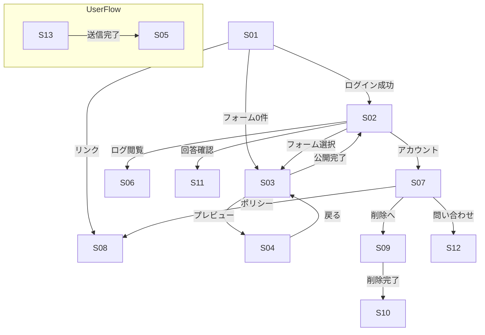

# 🎨 UI Design — Astro Form

> **目的**: 開発者 & AI ペアコーディングツールが画面遷移と UI 構成を即座に把握できるようにする *Living Document*。
> **対象**: フロントエンド実装者、デザイナー、プロダクトオーナー
> **更新方針**: 実装が進むごとに本ドキュメントを更新し、UI の最新状態を反映する。

---

## 1 📋 画面一覧 & ID 付番

| 画面ID | 画面名 (英語キー)    | 主な役割                                              |
| ---- | ------------- | ------------------------------------------------- |
| S01  | Login         | Microsoft Entra External ID サインイン                 |
| S02  | FormList      | フォーム一覧・検索・作成ボタン                                   |
| S03  | FormEditor    | フォーム設定 + 質問設計 + 公開 ※システム管理者は問い合わせフォーム(S12)も作成可 |
| S04  | FormPreview   | HTML 生成プレビュー & レイアウト確認                            |
| S05  | PostSubmit    | 送信後サンクスページ（または外部 URL）                             |
| S06  | LogViewer     | ログ閲覧・フィルタ                                         |
| S07  | Account       | プロフィール・プライバシーポリシー・問い合わせ                           |
| S08  | PrivacyPolicy | 静的プライバシーポリシー                                      |
| S09  | AccountDelete | アカウント削除確認 & 実行                                    |
| S10  | GoodBye       | アカウント削除後の Good‑bye 画面                             |
| S11  | AnswerReview  | 回答結果の確認（占い師向け）/CSV 出力                             |
| S12  | ContactForm   | 問い合わせフォーム（占い師向け）                                  |
| S13  | PublishedForm | 公開フォーム（ユーザー向け）                                    |

---

## 2 🔀 画面遷移図 (Mermaid Diagram)

> **注**: UserFlow は公開フォーム (S13) からサンクスページ (S05) への独立フロー。管理系とは分離して表現。

---

## 3 🧩 主コンポーネント構成 (抜粋)

| 画面ID | 主要コンポーネント                                                           | 補足                             |
| ---- | ------------------------------------------------------------------- | ------------------------------ |
| S01  | `LoginCard`, `AppShell`                                             | パスワードリセットは Microsoft 標準 UI に委譲 |
| S02  | `FormList`, `CommandBar`                                            | ページング: `DetailsList` + 仮想化     |
| S03  | `FormEditor`, `Breadcrumb`, `SaveButton`                            | 3カラム: 設定, 質問, プレビュータブ          |
| S04  | `FormPreview`, `PreviewToolbar`                                     | iframe + スマホ/PC 切替ボタン          |
| S06  | `LogTable`, `LogFilterBar`                                          | 列ドラッグ & サイズ変更可                 |
| S07  | `AccountCard`, `DeleteAccountDialog`                                | リンクで S08, S09, S12 へ遷移         |
| S09  | `ConfirmDialog`                                                     | 二段階確認 → API 呼び出し               |
| S11  | `AnswerTable`, `AnswerFilterBar`, `CsvExportButton`                 | 回答一覧・CSV ダウンロード                |
| S12  | `ContactForm`, `SubmitButton`                                       | 問い合わせ入力画面                      |
| S13  | `PublishedForm`, `QuestionRenderer`, `HiddenFields`, `SubmitButton` | 公開フォーム。バリデーション後 S05 へリダイレクト    |

> フル一覧は [Ui-components](./ui-components) を参照。

---

## 4 📱 レスポンシブ方針

* **ブレークポイント**: 480px / 768px / 1024px
* **レイアウト**:

  * モバイル: 1 カラム (Header 非表示、Hamburger Menu)
  * タブレット: 1.5 カラム (SideNav 折りたたみ)
  * デスクトップ: 2 ペイン (SideNav 固定 + Content)
* Fluent UI の `Stack` / `Grid` を標準使用
* **サイドバー共通リンク**:

  * フォーム一覧（S02）
  * 回答確認（S11）
  * アカウント（S07）

---

## 5 🎨 デザインシステム指針

| 項目       | 方針                                        |
| -------- | ----------------------------------------- |
| カラー      | Fluent UI デフォルト (テーマ対応: Light / Dark)     |
| タイポグラフィ  | Segoe UI, 12–20px スケール                    |
| アイコン     | Fluent UI Icons (`@fluentui/react-icons`) |
| モーション    | `Motion` API: フェード & スライド最小限              |
| アクセシビリティ | WCAG 2.1 AA 準拠、キーボード操作必須                  |

---

## 6 🚧 OPEN POINTS / TODO

* [ ] FormEditor の質問設計 UI 詳細 (ドラッグ&ドロップ or メニュー選択?)
* [ ] ログテーブルの CSV エクスポート要否
* [ ] サンクスページ (S05) のカスタム URL 設定フロー
* [ ] ダークテーマのトークン調整
* [ ] 回答結果のソート／フィルタの定義（S11）
* [ ] 問い合わせフォームの作成ルール（S13 用テンプレート活用）

> *このセクションはスプリントごとに消化／追加して管理する*
